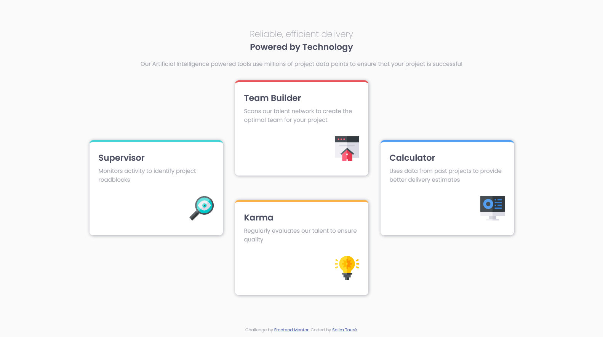

# Frontend Mentor - Four card feature section solution

This is a solution to the [Four card feature section challenge on Frontend Mentor](https://www.frontendmentor.io/challenges/four-card-feature-section-weK1eFYK). Frontend Mentor challenges help you improve your coding skills by building realistic projects.

## Table of contents

- [Overview](#overview)
  - [The challenge](#the-challenge)
  - [Screenshot](#screenshot)
  - [Links](#links)
- [My process](#my-process)
  - [Built with](#built-with)
  - [What I learned](#what-i-learned)
  - [Continued development](#continued-development)
  - [Useful resources](#useful-resources)
- [Author](#author)

## Overview

### The challenge

Users should be able to:

- View the optimal layout for the site depending on their device's screen size

### Screenshot



### Links

- Live Site URL: [Live site URL](https://https://limsael.github.io/four-card-feature-section/)

## My process

### Built with

- Semantic HTML5 markup
- CSS custom properties
- Flexbox
- CSS Grid
- Mobile-first workflow

### What I learned

```css

  .cards {
    grid-template-columns: repeat(3, 350px);
    grid-template-rows: repeat(4, 125px);
    justify-content: center;

    .card {
      padding-bottom: 0;
      height: 250px;
    }
    .card__supervisor,
    .card__calculator {
      grid-row: 2 / 4;
    }

    .card__team {
      grid-row: 1 / 3;
    }

    .card__karma {
      grid-row: 3 / 5;
    }
  }
```

### Continued development

- The cards layout
- The tablet view

### Useful resources

- [Flexbox Froggy](https://www.flexboxfroggy.com) - This helped me for XYZ reason. I really liked this pattern and will use it going forward.
- [CSS Grid Garden](https://www.cssgridgarden.com) - This is an amazing website which helped me  understand CSS Grid. I'd recommend it to anyone still learning this concept.

## Author

- Frontend Mentor - [@limsael](https://www.frontendmentor.io/profile/limsael)
- Twitter - [@limsael525](https://www.twitter.com/limsael525)
